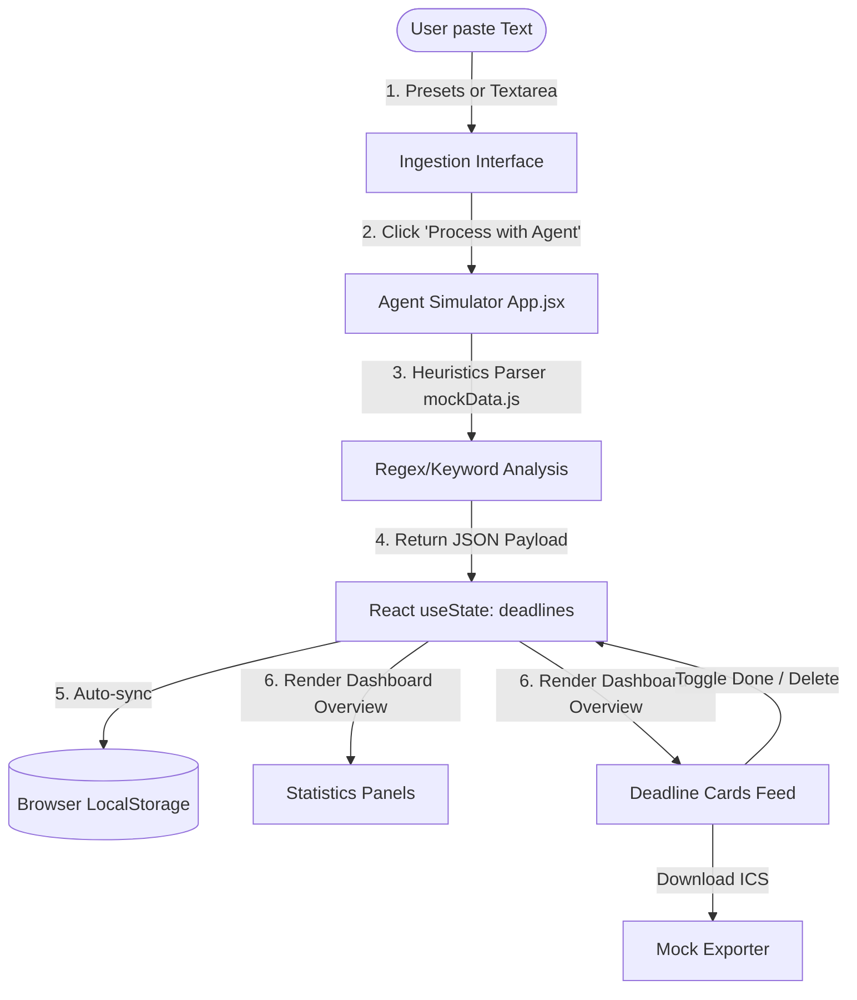

# Deadlines & Syllabus Inbox Agent - Architecture & Gemini Integration Guide

This document explains how the current prototype of the **"Deadlines & Syllabus Inbox Agent"** university microproject works and outlines a concrete implementation plan to connect the live **Gemini API** for production-grade email and chat log parsing.

---

## 1. How the Current Application Works

The dashboard is built as a Single Page Application (SPA) using **Vite + React** and **Tailwind CSS v4**. It relies on client-side state and heuristics to simulate a real agent flow.

### Architecture Overview



### Key Modules
1. **Main Entry Point (`src/App.jsx`)**:
   - **Navigation State**: Controls sidebar tabs: "Dashboard Overview", "Ingest Logs/Emails", and "Calendar Export Logs".
   - **Deadlines State**: Manages the schedule array. Synchronizes instantly to the browser's `localStorage` so that your deadlines persist when refreshing the browser.
   - **Ingest & Export Logs**: Simulates and tracks background activities.
   - **Agent Simulation Console**: Displays a terminal console running through parsing steps (syntax analysis, course alignment, entity recognition) to visualize the agent workflow.

2. **Data & Heuristics Engine (`src/mockData.js`)**:
   - Houses initial mock deadlines, template presets (emails, Discord announcements, WhatsApp chats), and logs.
   - Contains `simulateAgentParser(text, course)` which scans keywords (like "Assignment", "Exam", "Quiz", "Due") and automatically creates a mock academic event record with appropriate deadlines and urgency levels.

3. **Mock iCalendar Exporter**:
   - Dynamically filters active (pending) deadlines and generates standard `.ics` schema payloads.
   - Logs the activity in the *Calendar Export Logs* history table.

---

## 2. Live Gemini API Integration Plan

To transition from mock parsing to real AI extraction, we can leverage Google's **Gemini 2.5 Flash** model. This allows the application to parse arbitrary emails and messy group chat screenshots/text logs, automatically identifying due dates, description summaries, and classes with high accuracy.

### Step 1: Install the Gemini Web SDK
In your project directory, install Google's official Generative AI SDK:
```bash
npm install @google/generative-ai
```

### Step 2: Get a Gemini API Key
1. Go to [Google AI Studio](https://aistudio.google.com/).
2. Log in with your Google account.
3. Click on **"Get API Key"** and create a new key.
4. Keep this key secure.

---

### Step 3: Implement the Gemini API Parser in your Code

We can update `src/mockData.js` to define a real Gemini calling function. 

Create a new file `src/geminiService.js` or write this utility:

```javascript
import { GoogleGenerativeAI } from "@google/generative-ai";

/**
 * Parses university announcements into structured deadline objects using Gemini 2.5 Flash.
 * 
 * @param {string} text - Raw email body, WhatsApp log, or Discord text.
 * @param {string} selectedCourse - The targeted course dropdown value.
 * @param {string} apiKey - User's Gemini API key.
 * @returns {Promise<Array>} List of extracted deadline objects.
 */
export async function parseDeadlinesWithGemini(text, selectedCourse, apiKey) {
  if (!apiKey) {
    throw new Error("Gemini API Key is missing. Add your key in settings.");
  }

  // Initialize generative AI client
  const genAI = new GoogleGenerativeAI(apiKey);
  
  // Use Gemini 2.5 Flash for fast, structured text processing
  const model = genAI.getGenerativeModel({ 
    model: "gemini-2.5-flash",
    // Force the model to respond with valid JSON schema
    generationConfig: {
      responseMimeType: "application/json",
    }
  });

  const systemPrompt = `
You are a university academic assistant agent. You parse raw email messages, WhatsApp messages, or Discord chats to extract deadlines, exams, lab submissions, and syllabus schedules.

Analyze the input text and extract all events. Return a JSON array of objects with the exact structure below. 
If a specific field is not explicitly mentioned, infer a sensible value based on the text context.

Format requirements:
1. "course": Use "${selectedCourse}" as the default, unless a different course name is explicitly mentioned in the text.
2. "title": A brief, descriptive title of the assignment, quiz, exam, or project.
3. "description": A concise summary of syllabus requirements, submissions guidelines, or syllabus context.
4. "dueDate": Format as a local ISO datetime string without timezone information (e.g. "YYYY-MM-DDTHH:MM"), such as "2026-07-25T23:59".
   - If the exact time isn't mentioned, default to "23:59".
   - If only a date is mentioned, use that date.
   - If no year is mentioned, assume the current academic year 2026.
5. "urgency": Return either "High", "Medium", or "Low" based on the professor's tone, weights, or proximity of the date.
6. "status": Always default to "Pending".

Example output format:
[
  {
    "course": "Computer Networks",
    "title": "Assignment 3: Routing Protocols",
    "description": "Implement Dijkstra's routing algorithms in Python. Worth 10% of overall grade.",
    "dueDate": "2026-07-24T23:59",
    "urgency": "High",
    "status": "Pending"
  }
]
  `;

  const prompt = `Input Text announcement to parse:\n"""\n${text}\n"""`;

  try {
    const result = await model.generateContent([systemPrompt, prompt]);
    const responseText = result.response.text();
    
    // Parse response string into JavaScript Array
    const parsedData = JSON.parse(responseText);
    
    // Add unique IDs to the parsed items
    return parsedData.map((item, index) => ({
      ...item,
      id: `dl-gemini-${Date.now()}-${index}`
    }));
  } catch (error) {
    console.error("Gemini Parsing Error:", error);
    throw new Error(error.message || "Failed to parse text with Gemini Agent.");
  }
}
```

---

### Step 4: Integrate into the React Interface

Now, update the React dashboard component [App.jsx](file:///c:/Users/Aditya%20bhanushali/OneDrive/Desktop/AI_PROJECT/src/App.jsx) to support user-entered API Keys:

1. **State variables in `App.jsx`**:
   ```javascript
   const [apiKey, setApiKey] = useState(() => {
     return localStorage.getItem("gemini_api_key") || "";
   });
   const [useLiveAI, setUseLiveAI] = useState(false);
   ```

2. **Add a Settings Box in the Sidebar**:
   Inside the `<aside>` element, render an option to input the key:
   ```jsx
   <div className="p-4 border-t border-slate-100 dark:border-slate-800 space-y-2">
     <div className="flex items-center justify-between">
       <span className="text-xs font-semibold text-slate-500 dark:text-slate-400">Live Gemini Parser</span>
       <input 
         type="checkbox"
         checked={useLiveAI}
         onChange={(e) => setUseLiveAI(e.target.checked)}
         className="h-4 w-4 rounded border-slate-300 text-violet-600 focus:ring-violet-500 cursor-pointer"
       />
     </div>
     
     {useLiveAI && (
       <div className="space-y-1">
         <label className="text-[10px] font-bold text-slate-400 dark:text-slate-500 uppercase">Gemini API Key</label>
         <input 
           type="password"
           placeholder="Paste key here..."
           value={apiKey}
           onChange={(e) => {
             setApiKey(e.target.value);
             localStorage.setItem("gemini_api_key", e.target.value);
           }}
           className="w-full px-2 py-1.5 rounded-lg border border-slate-200 dark:border-slate-800 bg-white dark:bg-slate-900 text-xs focus:outline-hidden text-slate-800 dark:text-slate-200"
         />
       </div>
     )}
   </div>
   ```

3. **Update the `handleProcessText` Event Handler**:
   Adjust the simulation code to trigger the real API call if `useLiveAI` is active:
   ```javascript
   // Inside handleProcessText in App.jsx:
   const handleProcessText = async () => {
     if (!rawText.trim()) {
       showToast('Please paste email or chat text first!', 'error');
       return;
     }

     if (useLiveAI && !apiKey.trim()) {
       showToast('Please enter your Gemini API Key in the settings panel!', 'error');
       return;
     }

     setIsProcessing(true);
     setProcessingSteps([
       'Initializing Gemini Agent parsing pipeline...',
       'Sending prompt request payload to Gemini 2.5 Flash...',
       'Running named-entity extraction on academic metrics...',
       'Generating structured JSON schedule records...'
     ]);
     setCurrentStepIndex(0);

     if (!useLiveAI) {
       // local mock parsing flow runs normally via setTimeout steps
       return;
     }

     // Live API execution
     try {
       const newEvents = await parseDeadlinesWithGemini(rawText, selectedCourse, apiKey);
       
       setDeadlines(prev => {
         const filteredNew = newEvents.filter(
           ne => !prev.some(pe => pe.title.toLowerCase() === ne.title.toLowerCase() && pe.course === ne.course)
         );
         
         if (filteredNew.length === 0) {
           showToast('No new deadlines parsed or already existing.', 'info');
           return prev;
         }

         showToast(`Gemini successfully extracted ${filteredNew.length} deadline(s)!`, 'success');
         return [...filteredNew, ...prev];
       });

       // Log to history
       setIngestLogs(prev => [{
         id: `log-gemini-${Date.now()}`,
         timestamp: new Date().toISOString().substring(0, 19),
         source: 'Gemini 2.5 Flash API',
         status: 'Success',
         message: `Parsed ${newEvents.length} event(s) for ${selectedCourse} using LLM agent.`
       }, ...prev]);

     } catch (err) {
       showToast(err.message, 'error');
     } finally {
       setIsProcessing(false);
       setProcessingSteps([]);
       setCurrentStepIndex(-1);
     }
   };
   ```

---

## 3. Security & Hosting Best Practices

- **Never Hardcode Keys**: Do not write the Gemini API Key directly into your source code. By binding it to an input field and storing it in `localStorage` in the browser, you keep the key safe on your local browser profile. It is never checked into GitHub.
- **Vite Environment Variables**: If you host this for yourself as a personal utility, you can also store the key in a `.env.local` file as `VITE_GEMINI_API_KEY` and access it via `import.meta.env.VITE_GEMINI_API_KEY`.

---

## 4. Automating Ingestion with Microsoft Teams Graph API

To move away from copy-pasting, we use a background polling script ([teams_poller.js](file:///c:/Users/Aditya%20bhanushali/OneDrive/Desktop/AI_PROJECT/teams_poller.js)) that runs on your local server. It watches a specific Microsoft Teams channel for new posts, passes them to the Gemini API, and updates your dashboard database automatically.

### Step 1: Microsoft Entra ID (Azure AD) App Registration
To authorize the background worker script to read your Microsoft Teams channel, register an app in Microsoft Azure:
1. Log in to the [Azure Portal](https://portal.azure.com/) / Entra ID Admin Center.
2. Navigate to **App Registrations** > **New Registration**.
3. Name your application (e.g. `TeamsSyllabusPoller`) and select **Single Tenant**.
4. Once registered, copy the **Application (client) ID** and **Directory (tenant) ID** from the Overview tab.
5. Under **Certificates & Secrets**, click **New Client Secret** and copy the secret string value immediately.

### Step 2: Grant Microsoft Graph API Permissions
The background script runs in application mode (without a logged-in user). You must grant the correct Graph API access scopes:
1. Navigate to **API Permissions** > **Add a permission** > **Microsoft Graph**.
2. Select **Application Permissions**.
3. Search and check the following permissions:
   - `ChannelMessage.Read.All` (To query and read messages in Teams channels)
   - `Group.Read.All` (Required for channel scanning scope permissions)
4. Click **Add permissions**.
5. **IMPORTANT**: Click **"Grant admin consent for [Your Organization Name]"** (requires IT admin authorization).

### Step 3: Configure Environment Variables
Create a file named `.env` in the root of your project directory:
```env
# Gemini API credentials
GEMINI_API_KEY=your_gemini_api_key_here

# Microsoft Graph API credentials
TEAMS_TENANT_ID=your_directory_tenant_id_here
TEAMS_CLIENT_ID=your_application_client_id_here
TEAMS_CLIENT_SECRET=your_client_secret_value_here

# Target Channel Details (obtained from channel link in Teams)
TEAMS_TEAM_ID=your_microsoft_team_id_here
TEAMS_CHANNEL_ID=your_channel_id_here
```

### Step 4: Run the Poller
Install the Azure Identity SDK and poller modules:
```bash
npm install @microsoft/microsoft-graph-client @azure/identity dotenv
```
Run the poller script:
```bash
node teams_poller.js
```
The script will now sync with Microsoft Teams, scan for syllabus announcements, parse them using Gemini, and write them directly to `src/auto_parsed_deadlines.json` in the background. Your dashboard can then read from this JSON file automatically to display synchronized deadlines!

